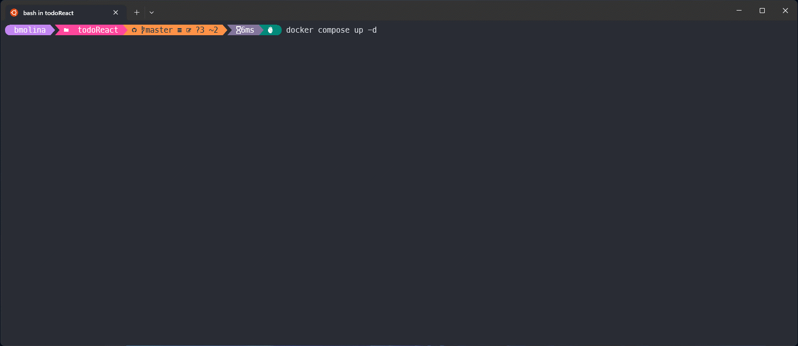
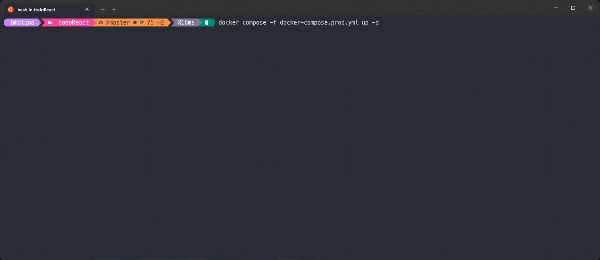

<a href="README.en.md">
  
</a>

# Todo list 🗒️
<div>
  <a href="https://ubuntu.com/wsl" target="_blank">
    
  </a>
  <a href="https://www.docker.com/" target="_blank">
    
  </a>
  <a href="https://docs.docker.com/compose/" target="_blank">
    
  </a>
  <a href="https://nginx.org/en/docs/" target="_blank">
    
  </a>
  <a href="https://nodejs.org/en/" target="_blank">
    
  </a>
  <a href="https://www.npmjs.com/" target="_blank">
    
  </a>
  <a href="https://pages.github.com/" target="_blank">
    
  </a>
  <a href="https://reactjs.org/" target="_blank">
    
  </a>
</div>

### Previous requirements 📝
- Docker Compose **versión 2.x**
- Run commands in **root** project

#### Environment variables
Set project variables in **.env** file
```bash
# development
DEV_APP_NAME="todolist-app-dev" # App name
DEV_APP_VERSION=1.0.0 # App version
DEV_APP_PORT=3000 # FrontEnd port

# production
PROD_APP_NAME="todolist-app-prod"
PROD_APP_VERSION=1.0.0
PROD_APP_PORT=3001
```

## Docker Compose 
### Development ⛏️
```bash
$ docker compose up -d
```

### Demo 🎬


### Useful commands 🔧
Access container directory
```bash
$ docker compose exec todolist-app-dev sh
```
Remove container/network
```bash
$ docker compose down
```
Container logs
```bash
$ docker compose logs todolist-app-dev
```

---

### Production with Nginx ⚙️
```bash
$ docker compose -f docker-compose.prod.yml up -d
```

### Demo 🎬


### Useful commands 🔧
Access container directory
```bash
$ docker compose exec todolist-app-prod sh
```
Remove container/network
```bash
$ docker compose -f docker-compose.prod.yml down
```
Container logs
```bash
$ docker compose -f docker-compose.prod.yml logs todolist-app-prod
```

## Docker commands 
### Development ⛏️
```bash
$ docker build -t todolist-app-dev:1.0.0 .
```
```bash
$ docker volume create todolist-app-dev
```
```bash
$ docker run -d --name todolist-app-dev -p 3000:8080  \
--mount type=bind,source="$(pwd)",target=/app  \
--mount type=volume,source=todolist-app-dev,target=/app/node_modules  \
todolist-app-dev:1.0.0
```

### Demo 🎬


### Useful commands 🔧
Access container directory
```bash
$ docker exec -it todolist-app-dev sh
```
Container logs
```bash
$ docker logs todolist-app-dev
```

---

### Production with Nginx ⚙️
```bash
$ docker build -t todolist-app-prod:1.0.0 -f Dockerfile.prod .
```
```bash
$ docker run -d --restart always --name todolist-app-prod -p 3001:80 todolist-app-prod:1.0.0
```

### Demo 🎬


### Useful commands 🔧
Access container directory
```bash
$ docker exec -it todolist-app-prod sh
```
Container logs
```bash
$ docker logs todolist-app-prod
```


## Important information 📑
### Image
```bash
$ docker images
```
| REPOSITORY        | TAG   | SIZE   |
| ----------------- | ----- | ------ |
| todolist-app-dev  | 1.0.0 | 488MB  |
| todolist-app-prod | 1.0.0 | 41.3MB |

### Volume
```bash
$ docker volume ls
```
| DRIVER | VOLUME NAME      |
| ------ | ---------------- |
| local  | todolist-app-dev |

### Network
```bash
$ docker network ls
```
| NAME              | DRIVER | SCOPE |
| ----------------- | ------ | ----- |
| todolist-app-dev  | bridge | local |
| todolist-app-prod | bridge | local |

### Container
```bash
$ docker compose ps
```
| NAME              | IMAGE                   | SERVICE           | PORTS                                     |
| ----------------- | ----------------------- | ----------------- | ----------------------------------------- |
| todolist-app-dev  | todolist-app-dev:1.0.0  | todolist-app-dev  | 0.0.0.0:3000->8080/tcp, :::3000->8080/tcp |
| todolist-app-prod | todolist-app-prod:1.0.0 | todolist-app-prod | 0.0.0.0:3001->80/tcp, :::3001->80/tcp     |
